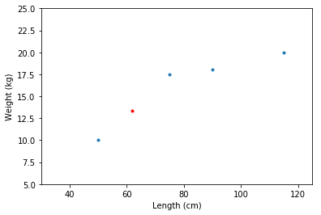
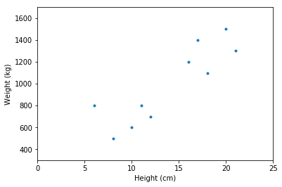

# 二、数据分析

这本笔记本讲解了一些，我们可能想要使用数据科学方法做的事情的最小例子。

特别是，为了以下目的，它简要介绍了数据分析：

- 预测：分析可用数据，以便能够对未来数据进行预测
- 分类：以有意义的方式对数据进行分组
- 知识发现：寻求发现数据及其所代表现象的新知识

这些示例将开始使用 python 数据科学工具包中的包，以及一些简单的算法来说明示例案例。

这里的目标是，在代码中看到，数据科学有兴趣做的事情的概况。

这些工具和算法将在未来的笔记本中得到更全面的描述和正确介绍。

```python
%matplotlib inline

# 为一些简单示例导入 matplotlib 和 numpy
import matplotlib.pyplot as plt
import numpy as np
```

# 预测

预测是使用当前（训练）数据来预测未来的观测。

###示例问题

让我们假设我们想从狗的长度预测体重。

也许，例如，使用卷尺比将狗放到秤上更容易，所以如果我们可以从它们的长度推断它们的重量，我们可以节省很多时间。

```python
# 我们以一些数据开始
lengths = [75, 50, 90, 115]    # 单位 cm
weights = [17.5, 10, 18, 20]   # 单位 kg


# 绘制数据：始终展示你的数据
f, ax = plt.subplots()
ax.plot(lengths, weights , '.')
plt.xlabel('Length (cm)'); plt.xlim([30, 125]);
plt.ylabel('Weight (kg)'); plt.ylim([5, 25]);
```


```python
# Polyfit (degree=1) 会将直线拟合到数据，形式为 y = ax + b
#  一旦我们将这个简单模型拟合到数据
# 我们就可以使用它来对新数据点做预测
a, b = np.polyfit(lengths, weights, 1)


# 所以现在我们可以预测一个新观测（一只新的狗）的重量
new_length = 62
pred_weight = a * new_length + b 
print('Predicted weight for a new data point, weight  is', pred_weight)

# Predicted weight for a new data point, weight  is 13.3460674157


# 我们可以检查我们的预测如何与我们观察到的数据相符
ax.plot(new_length, pred_weight, '.r')
f
```



```python
# 如果我们碰巧知道测试数据的真实重量
# 我们可以检查我们的预测有多好
actual_weight = 14.7
error = actual_weight - pred_weight

print('The (absolute) error of our prediction is', str(error), 'kg\'s.')

# The (absolute) error of our prediction is 1.35393258427 kg's.
```

我们如何进行预测将变得更加复杂，因为我们处理大量杂乱的数据以及各种“形状”的更多变量。

从根本上说，它归结为同一个过程：我们可以从一组数据中学到什么，这样，给定一个新的数据，我们可以对它进行预测（并使用答案已知的测试数据，来评估我们的预测模型有多好）。

# 分类

分类（或聚类）是尝试发现数据的系统组织的过程。

###问题

我们当地的动物学家正在调查一群松鼠。

她想知道总体中有多少种不同的物种，但只有基本数据可供使用。

我们可以尝试对我们拥有的数据进行聚类，并寻找（看起来像是）有意义的分组。

```python
# 我们观察到一堆松鼠的“身高（cm），体重（g）”对
dat = np.array([[10., 600.], [16., 1200], [6., 800], [12., 700.], [17., 1400.],
               [8., 500.], [20., 1500.], [21., 1300.], [11., 800.], [18., 1100.]])


# 展示数据！
f, ax = plt.subplots()
ax.plot(dat[:, 0], dat[:, 1], '.')
plt.xlabel('Height (cm)'); plt.xlim([0, 25]);
plt.ylabel('Weight (kg)'); plt.ylim([300, 1700]);
```





```python
# 让我们尝试一个聚类算法
# 如果你对 KMeans 不熟悉，我们将在稍后回顾它的工作原理
from sklearn.cluster import KMeans
kmeans = KMeans(2).fit(dat)


# 这为我们提供了每个数据点的标签，以及它所属的簇
kmeans.labels_

# array([0, 1, 0, 0, 1, 0, 1, 1, 0, 1], dtype=int32)


# 我们可以使用它们将我们的数据集拆分为假定的分组
cl_1 = dat[kmeans.labels_ == 0]
cl_2 = dat[kmeans.labels_ == 1]


# 并可视化分类
f, ax = plt.subplots()
ax.plot(cl_1[:, 0], cl_1[:, 1], '.b')
ax.plot(cl_2[:, 0], cl_2[:, 1], '.r')
plt.xlabel('Height (cm)'); plt.xlim([0, 25]);
plt.ylabel('Weight (kg)'); plt.ylim([300, 1700]);
```


评估分类，特别是在这样的无监督的情况下（当我们不知道答案时）是非常重要的。很难知道这里是否真的有两个组 - 或者更多或更少。我们将回到这些分析如何实际运作，以及如何评估你从中获得的结果。

## 知识发现


知识发现是从数据中学习世界的新事物的尝试。

知识发现不一定在方法上与预测和分类不同，因为寻求新知识可能包括侧重于分类和预测的分析。