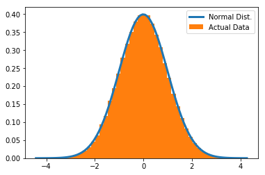
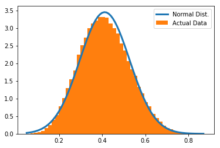

# 检验分布


有时，正式检验你观察到的某些数据是否遵循特定分布，可能是有用的（或必要的）。

也许最常见的是，如果你使用假定数据具有特定分布的统计检验，则需要测试是否确实如此。

```python
# 导入
%matplotlib inline

import numpy as np
import matplotlib.pyplot as plt

import scipy.stats as stats
from scipy.stats import normaltest


# 设置一个辅助函数，用于在 alpha 水平上检查 p 值和打印结果
def check_p_val(p_val, alpha):

    if p_val < alpha:
        print('We have evidence to reject the null hypothesis.')
    else:
        print('We do not have evidence to reject the null hypothesis.')
```

在这里，我们将关注最常见的情况：测试数据集是否正态分布。

```python
# 创建正态分布的数据集
d1 = stats.norm.rvs(size=100000)


# 绘制观测数据的直方图
# 如果数据是正态分布的，则包括预期分布，具有相同的数据均值和标准。
xs = np.arange(d1.min(), d1.max(), 0.1)
fit = stats.norm.pdf(xs, np.mean(d1), np.std(d1))
plt.plot(xs, fit, label='Normal Dist.', lw=3)
plt.hist(d1, 50, normed=True, label='Actual Data');
plt.legend();
```





```python
# 在 scipy 中，“normaltest” 函数测试样本是否与正态分布不同
# 零假设是数据是正态分布的。
# 我们可以使用 normaltest 来检查这个原假设  - 我们是否必须拒绝原假设（断定数据不是正态）。
# 它使用观察数据的偏斜和峰度的组合统计量，与正态分布下的预期相比。
normaltest?


# 在数据集上执行正态测试
stat, p_val = normaltest(d1)


# 检查 normaltest 的 p 值
print('\nNormaltest p value is: {:1.2e} \n'.format(p_val))

# 当 alpha 值为 0.05 时，我们应该如何处理
check_p_val(p_val, alpha=0.05)

'''
Normaltest p value is: 1.34e-01 

We do not have evidence to reject the null hypothesis.
'''
```

    
    

#### 不同分布

视觉检查数据集可以让你快速了解它们是否正态分布。

然而，视觉检查是不够的，并且可能会产生误导，因为非正态数据可能“看起来正态”。

除了在看起来很正态时查看检查数据，执行其他检查也很重要。

例如，在一些参数下，Beta 分布的数据看起来通常是正态的。

```python
# 从 beta 分布生成一些数据
d2 = stats.beta.rvs(7, 10, size=100000)


# 绘制观测数据的直方图
plt.hist(d2, 50, normed=True, label='Actual Data');
plt.legend();
```


如上所示，我们可能认为这些数据看起来非常正态，基于可视化。

但是，我们可以做更具体的检查。

```python
# 在它是正态分布的假设下，用预期分布绘制数据。
# 如果数据是正态的，蓝线是预期的数据密度，具有相同的平均值和标准差。
xs = np.arange(d2.min(), d2.max(), 0.01)
fit = stats.norm.pdf(xs, np.mean(d2), np.std(d2))
plt.plot(xs, fit, label='Normal Dist.', lw=3)
plt.hist(d2, 50, normed=True, label='Actual Data');
plt.legend();

# 请注意，在绘制 PDF 时，我们可以看到某些差异
# 但是，如果你关闭 PDF 图，我们可能会猜测这些数据看起来是正态的
```





```python
# 在数据集上执行正态测试
stat, p_val = normaltest(d2)


# 检查 normaltest 的 p 值
print('\nNormaltest p value is: {:1.2e} \n'.format(p_val))

# 当 alpha 值为 0.05 时，我们应该如何处理
check_p_val(p_val, alpha=0.05)

'''
Normaltest p value is: 2.17e-184 

We have evidence to reject the null hypothesis.
'''
```

    
    

#### 非正态数据

在这个例子中，图形是不确定的，但“正态测试”表明这些数据实际上不太可能来自正态分布。

在这种情况下，我们碰巧知道这确实是正确的，因为数据的“基本事实”是它们是从 beta 分布生成的。

因此，在期望正态分布输入的统计测试中使用此数据是无效的，因为我们违反了这些测试所基于的假设。我们将不得不使用不同的方法来对这些数据进行统计比较。

### 检验其它分布

更一般地，你可以使用 Kolmogorov-Smirnov 测试，来检查一组数据是否具有（你指定的）其他分布。

此测试在 scipy 中实现，你可以使用它进行探索。

```python
from scipy.stats import kstest


# 检查 kstest 的文档
kstest?
```

`kstest`形式与`normaltest`类似，在这种情况下，我们将数据样本与指定的分布进行比较。

零假设是数据来自指定的分布。

如果我们拒绝零假设，并使用一些预设的 alpha 值，我们可以得出结论，数据不符合所检验的分布。

```python
# 让我们继续使用上面的数据，来自 beta 分布。
# 我们可以确认 kstest 认为它不是正态分布的
stat, p_val = kstest(d2, 'norm')
print('Statistic: \t{:1.2f} \nP-Value: \t{:1.2e}\n'.format(stat, p_val))
check_p_val(p_val, alpha=0.05)

'''
Statistic: 	0.56 
P-Value: 	0.00e+00

We have evidence to reject the null hypothesis.
'''


# 现在将数据与 beta 分布进行比较。
# 请注意，在这种情况下，我们必须为我们正在测试的 beta 分布指定一些参数
stat, p_val = kstest(d2, 'beta', [7, 10])
print('Statistic: \t{:1.2f} \nP-Value: \t{:1.2e}\n'.format(stat, p_val))
check_p_val(p_val, alpha=0.05)

'''
Statistic: 	0.00 
P-Value: 	1.69e-01

We do not have evidence to reject the null hypothesis.
'''
```
