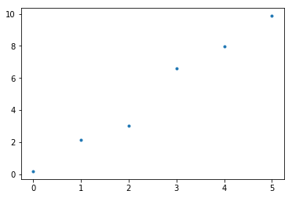
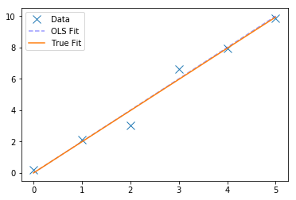

# Ordinary Least Squares

普通最小二乘法（OLS）意味着最小化模型做出的预测与观测数据之间的平方和的误差。

在[维基百科](https://en.wikipedia.org/wiki/Ordinary_least_squares)上查找有关 OLS 的更多信息，请查看这个很酷的[互动工具](http://setosa.io/ev/ordinary-least-squares-regression/)和/或查看在 Python 中执行 OLS 的[教程](https://www.datarobot.com/blog/ordinary-least-squares-in-python/)。

#### 普通最小二乘

普通最小二乘可以被认为是一个误差函数 - 在给定数据的情况下，我们形式化计算模型的误差的方式。

通常，我们希望最小化此误差项。因此，例如线性模型的 OLS 解，是具有最小平方误差值的模型，其被计算为数据点的模型预测与数据点本身之间的差的平方。

在这里，我们将创建一个最小数据集，并使用 OLS 探索将简单线性模型拟合到他。

```python
# 导入
%matplotlib inline

import random
import numpy as np
import matplotlib.pyplot as plt


# 创建一些数据
# x 是等间隔的整数数组
x = np.arange(0, 6)

# y 是一些数据，底层关系为 y = (theta) * x
# 对于这些示例，数据的真实关系为 y = 2x
true_rel = 2
y = true_rel * x

# 向 y 添加一些噪声
noise = np.random.normal(0, 0.5, len(x))
y = y + noise


# 绘制数据
f = plt.figure()
plt.plot(x, y, '.');
```





观察上面的数据，我们可以看到`x`和`y`之间存在某种关系，但我们想要一种方法来衡量这种关系是什么。OLS 是这样做的过程：找到最小化每个观测数据点与模型预测之间的平方距离的模型（在本例中为直线）。

```python
# 重塑数据来适配 NumPy
x = np.reshape(x, [len(x), 1])
y = np.reshape(y, [len(y), 1])
```

Numpy 为我们提供了计算 OLS 解的函数。 在这种情况下，我们拟合模型：

```
y = θ x
```

请注意，我们在这里没有拟合截距（没有`b`值，如果你想到`y = ax + b`）。 在这个简单的模型中，我们隐含地假设截距值为零。你可以使用 OLS 调整截距（以及具有更多参数的线性模型），你只需将它们添加到其中即可。

```python
# 使用 numpy 拟合（普通）最小二乘最佳直线
# 这给了我们拟合值（theta）和残差（我们在这个拟合中有多少误差）
theta, residuals, _, _ = np.linalg.lstsq(x, y)

# 从数组中拉出 theta 值
theta = theta[0][0]


# 检查 OLS 产生的 θ 解什么：
print(theta)

# 1.98695402961


# 检查我们的 OLS 解有多好
print('The true relationship between y & x is: \t', true_rel)
print('OLS calculated relationship between y & x is: \t', theta)

'''
The true relationship between y & x is: 	 2
OLS calculated relationship between y & x is: 	 1.98695402961
'''


# 检查残差是什么
residuals[0]

# 1.3701226131131277


# 绘制原始数据，具有真实的基础关系，以及 OLS 拟合
fig, ax = plt.subplots(1)
ax.plot(x, y, 'x', markersize=10, label='Data')
ax.plot(x, 2*x, '--b', alpha=0.4, label='OLS Fit')
ax.plot(x, theta*x, label='True Fit')
ax.legend();
```





```python
# 使用我们的模型，我们可以预测新的 'x' 数据点的值
new_x = 2.5
pred_y = theta * new_x
print('The prediction for a new x of {} is {:1.3f}'.format(new_x, pred_y))

# The prediction for a new x of 2.5 is 4.967


ax.plot(new_x, pred_y, 'or')
fig
```


```python
# 我们还可以看到，我们观察到的所有点，模型预测了什么
preds = theta * x


# 残差是模型拟合与观测数据点之间的平方和
# Re-calculate the residuals 'by hand'
error = np.sum(np.subtract(preds, y) ** 2)


# 检查我们的残差计算是否与 scipy 实现相匹配
print('Error from :', residuals[0])
print('Error from :', error)

'''
Error from : 1.37012261311
Error from : 1.37012261311
'''
```

注意：在实践中，你不会将 numpy 用于 OLS。其他模块，如`statsmodels`，拥有更明确用于线性建模的 OLS 实现。

请参阅“LinearModels”笔记本和/或[ StatsModels 中的 OLS](http://www.statsmodels.org/dev/generated/statsmodels.regression.linear_model.OLS.html)。

